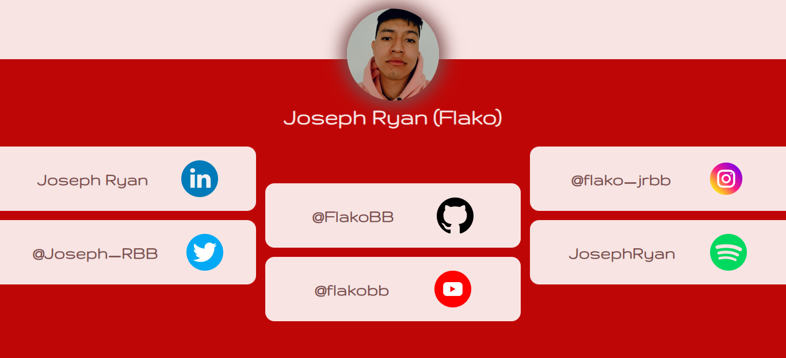
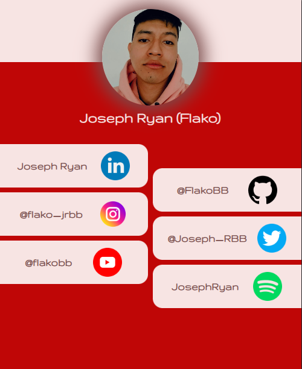

# **Follow Me**

[Despliegue](https://flakobb.github.io/follow-me/)

Pagina web sensilla que muestra una interfaz con un listado de enlaces hacia mis redes sociales.

Cuenta cun una estructura en HTML que consta dee un __header__ y un __section__. En el __header__ unicamnete se encuetra una imagen (foto de perfil); y en la __section__ encontramos un titulo con mi nombre y un __nav__ con todos los enlaces.

Los estilos de la pagina estan escritos con el preprocesador **SASS** y cuenta con adaptacion a diferentes tamaños de pantalla.